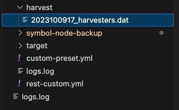

# harvesters.datをGoogleドライブへバックアップするスクリプト

このツールはGoogleドライブの指定したフォルダへSymbolノードのharvesters.datをバックアップするツールです。

初回はGoogleの認証情報を取得するためにPC（ローカル）で実行する必要があります。（ブラウザを開く必要があります）

PCで認証を実行した後、token.jsonが作成されるのでそれをサーバーへ転送します。

# 事前準備

## ソースコードの取得(ローカルPC・サーバー共通)

```bash
git clone git@github.com:ishidad2/symbol-node-backup.git
```

## GoogleドライブのフォルダIDを取得

事前にアップロード先のフォルダをGoogleドライブに作成し、URLからフォルダIDを取得しておく。

フォルダIDはGoogleドライブをブラウザで開き、フォルダを選択した際の最後の方に表示される値です。


## GoogleAPIを有効化しておく

以下を参考に環境をセットアップしてください。

[APIを有効にする](https://developers.google.com/drive/api/quickstart/python?hl=ja#enable_the_api)

[OAuth 同意画面を構成する](https://developers.google.com/drive/api/quickstart/python?hl=ja#configure_the_oauth_consent_screen)

認証情報を作成したら、credentials.jsonとしてリネームしてsymbol-node-backupフォルダへ保存します。


# インストール

## ライブラリのインストール(ローカルPC・サーバー共通)

```bash
cd symbol-node-backup
pip install -r requirements.txt
```

# pipが見つからないとき

```bash
sudo apt install -y python3-pip
```

## 初回実行(ローカルPC)

```bash
python3 g_drive_upload.py
```

ブラウザでGoogle認証が開くと思うので、アップロード先のフォルダを作成したGoogleアカウントを選択してします。

今回はテストユーザーを追加して認証を行なっているので、追加したテストユーザーで認証を行ってください。途中、「このアプリはGoogleで認証されていません」と表示されると思いますが、続行でOKです。

その後、表示されるアクセス権を確認して認証を完了してください。

※テストユーザーを追加していない場合は[OAuth 同意画面を構成する](https://developers.google.com/drive/api/quickstart/python?hl=ja#configure_the_oauth_consent_screen)を参考にテストユーザーを追加してください。

認証が通るとtoken.jsonが作成されます。


このtoken.jsonはサーバー側で使います。

credentials.jsonとtoken.jsonは漏洩しないように注意して扱ってください。
credentials.jsonは今後は不要なので削除してもOKです。

# サーバーで実行

## 手動実行

初回は手動実行で目的のファイルがアップロードされるか確認してください。

## GoogleドライブのフォルダIDを記載

`g_drive_upload.py`へGoogleドライブのフォルダIDを記載します。

(最初に確認したフォルダIDです)

```python
def upload_to_folder(service, filename):
    folder_id = 'xxxxxxxxxxxxxx'  # TODO: 実際のフォルダIDを設定してください
    file_metadata = {
        'name': filename,
        'parents': [folder_id]
    }
```

## 実行

```bash
./backup_harvester.sh
```

※スクリプトを実行するとtargetフォルダのある階層にharvestフォルダが自動作成されます。harvestフォルダにはバックアップするharvesters.datがコピーされます。



Googleドライブにharvesters.datファイルがアップロードされれば成功です。


# Cronで定期自動実行

Cronで定期的にスクリプトを実行する方法です。

例では1時間毎にファイルをアップロードします。ご自身の環境に合わせて設定してください。

```bash
crontab -e
```

```
0 * * * * cd /【symbolノードのtargetフォルダのパス】/symbol-node-backup/;/usr/bin/bash ./backup_harvester.sh
```